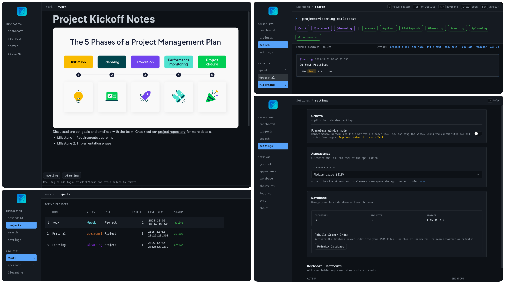

<div align="center">
  

# Yanta

**Yet Another Note Taking App**

A fast, keyboard-driven note-taking app built for developers.

[](https://github.com/omarahm3/yanta/releases)
[](https://github.com/omarahm3/yanta/releases)

</div>

<div align="center">
  
</div>


## Why Yanta?

Most note-taking apps get in your way. Yanta doesn't.

Your notes are stored as plain JSON files. No database lock-in. No proprietary formats. Just files you can version control, sync, and backup however you want.

**Fast native desktop app.** No Electron. No web bloat. Just instant startup and smooth editing.

**Keyboard-driven workflow.** Command palette, vim-style shortcuts, and a command line that feels natural.

## Features

**Rich text editing** with markdown shortcuts and code blocks. Write naturally without fighting your editor.

**Project-based organization** keeps work and personal notes separate. Switch contexts instantly.

**Full-text search** finds anything in milliseconds. Powered by SQLite FTS5.

**Flexible tagging** with autocomplete. Tag however makes sense to you.

**Git-friendly storage.** Your notes live in `~/.yanta/vault/` as JSON files. Commit them, sync them, back them up.

## Installation

Download from **[Releases](https://github.com/omarahm3/yanta/releases)**

### Linux

**Arch Linux:**

```bash
sudo pacman -U yanta-<version>-1-x86_64.pkg.tar.zst
```

**Ubuntu/Debian:**

```bash
sudo dpkg -i yanta_<version>_amd64.deb
```

**Quick Install Script:**

```bash
curl -sSL https://raw.githubusercontent.com/omarahm3/yanta/master/install.sh | bash
```

Yanta is Wayland-friendly and automatically handles X11/Wayland/NVIDIA configurations.

### Windows

- **Installer:** Run the `.exe` installer
- **Portable:** Extract and run `yanta.exe`

### macOS

Download the `.dmg` file and drag Yanta to Applications. Works on both Intel and Apple Silicon.

## Development

Built with Go, Wails V3, React, and SQLite. See [GUIDELINES.md](GUIDELINES.md) for architecture and contribution details.

### Setup

```bash
# Install Wails CLI
go install github.com/wailsapp/wails/v2/cmd/wails@latest

# Clone and run
git clone https://github.com/omarahm3/yanta.git
cd yanta
wails3 dev
```

### Testing

```bash
# Backend tests
go test ./...

# Frontend tests
cd frontend
npm run test
```

### Building

```bash
# Development build
wails3 build

# Release build
wails3 task release
```

## License

MIT License - See [LICENSE](LICENSE)

---

<div align="center">
  Built for developers who think better when they write things down.
</div>
