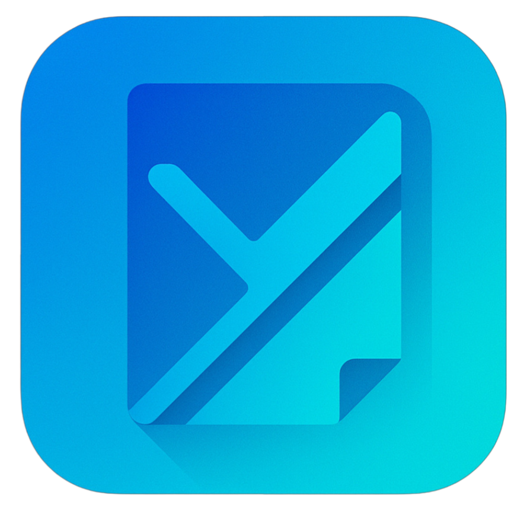

<div align="center">
  

# Yanta

**Yet Another Note Taking App**

A fast, keyboard-driven note-taking app built for developers.

[](https://github.com/omarahm3/yanta/releases)
[](https://github.com/omarahm3/yanta/releases)

</div>

---

## Why Yanta?

Most note-taking apps get in your way. Yanta doesn't.

Your notes are stored as plain JSON files. No database lock-in. No proprietary formats. Just files you can version control, sync, and backup however you want.

**Fast native desktop app.** No Electron. No web bloat. Just instant startup and smooth editing.

**Keyboard-driven workflow.** Command palette, vim-style shortcuts, and a command line that feels natural.

## Features

**Rich text editing** with markdown shortcuts and code blocks. Write naturally without fighting your editor.

**Project-based organization** keeps work and personal notes separate. Switch contexts instantly.

**Full-text search** finds anything in milliseconds. Powered by SQLite FTS5.

**Flexible tagging** with autocomplete. Tag however makes sense to you.

**Git-friendly storage.** Your notes live in `~/.yanta/vault/` as JSON files. Commit them, sync them, back them up.

## Download

Get the latest version: **[Releases](https://github.com/omarahm3/yanta/releases)**

**Windows:** Choose installer or portable executable
**macOS:** Universal binary for Intel and Apple Silicon
**Linux:** Pacman package (`yanta-<version>-1-x86_64.pkg.tar.gz`) installable via `sudo pacman -U` or any Pacman-compatible helper

### Linux Wayland Support

Yanta runs on Linux with Wayland via the XWayland compatibility layer. If you experience display issues on Wayland:

```bash
# Force X11 session when launching
unset WAYLAND_DISPLAY && ./yanta
```

Native Wayland support is tracked in [Wails issue #1420](https://github.com/wailsapp/wails/issues/1420).

## Quick Start

Launch Yanta. Your vault is created automatically at `~/.yanta/vault/`.

Press `:` to open the command line. Type `new` to create a project. Type `doc` to create a note.

That's it.

## Keyboard Shortcuts

| Shortcut | Action            |
| -------- | ----------------- |
| `:`      | Open command line |
| `Ctrl+K` | Command palette   |
| `Ctrl+B` | Toggle sidebar    |
| `?`      | Show help         |

## Configuration

Everything lives in `~/.yanta/`:

```
~/.yanta/
├── config.toml        # Settings
├── yanta.db          # Search index
└── vault/            # Your notes
    └── projects/
```

The `vault/` directory is perfect for Git. Version control your notes like code.

## Philosophy

**Files over databases.** Your notes shouldn't be trapped in someone else's format.

**Speed over features.** Native performance. No waiting. No lag.

**Keyboard over mouse.** Type faster than you click.

**Simple over complex.** Powerful doesn't have to mean complicated.

## For Developers

Built with Go, Wails, React, and SQLite. See [GUIDELINES.md](GUIDELINES.md) for architecture and contribution details.

```bash
git clone https://github.com/omarahm3/yanta.git
cd yanta
wails dev
```

## License

MIT License - See [LICENSE](LICENSE)

---

<div align="center">
  Built for developers who think better when they write things down.
</div>
